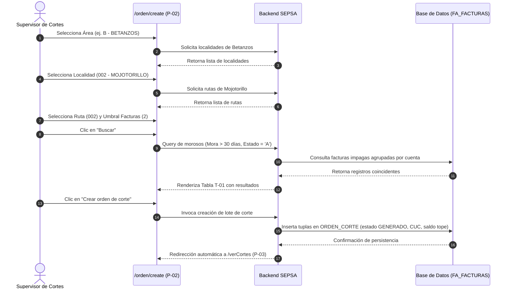

# FLOW-001: Filtrado de Morosidad y Emisión de Lote de Corte

## Objetivo

Identificar suministros en mora crítica en una ruta de distribución y generar formalmente las órdenes de corte para despacho a cuadrillas.

## Actor

Supervisor de Cortes / Operador Comercial.

## Evento Inicial

Navegación a `/orden/create` (`P-02`) desde el Dashboard.

## Precondiciones

Operador autenticado con rol de cortes en `cortes.sepsa.net.bo`.

## Diagrama de Secuencia

## Decisiones y Flujos Alternativos

- **Sin Resultados**: Si la consulta retorna 0 registros, el sistema muestra un mensaje informativo y deshabilita el botón de emisión masiva.
- **Auditoría Previa**: El operador puede pulsar "Ver Kardex" en cualquier fila antes de emitir para auditar las planillas del cliente.

## Casos de Prueba Derivados (TDD)

- `TC-FLOW-001-01`: Carga asíncrona de combos dependientes (Área $
ightarrow$ Localidad $
ightarrow$ Ruta).
- `TC-FLOW-001-02`: Inserción masiva de tuplas en `ORDEN_CORTE` con estado `GENERADO`.
