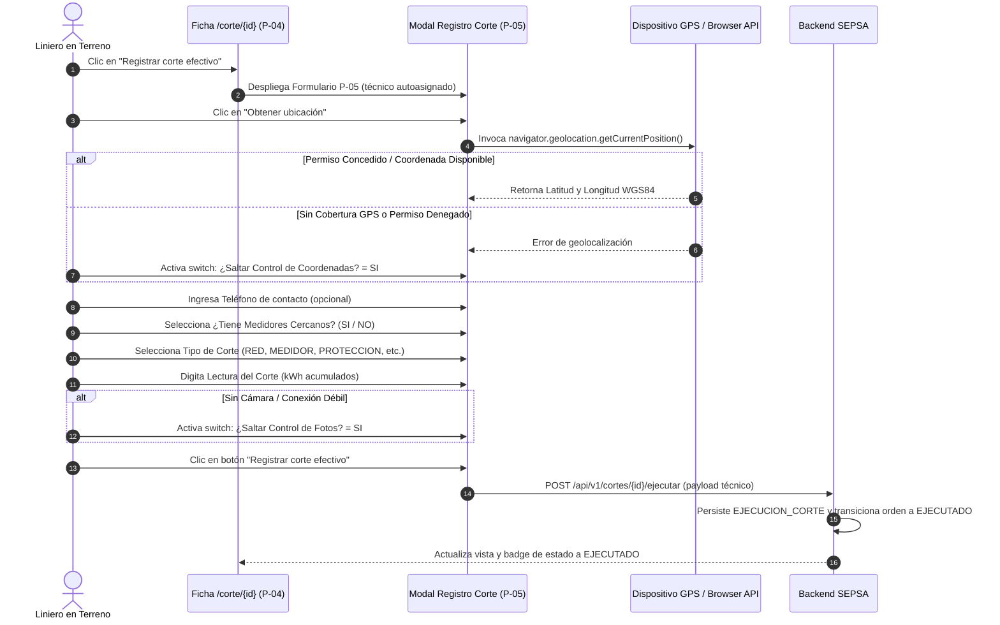

# FLOW-002: Ejecución y Registro de Corte Efectivo en Terreno

## Objetivo

Asentar formalmente en la plataforma la desconexión material del suministro ejecutada físicamente por la cuadrilla en campo.

## Actor

Liniero / Técnico de Campo.

## Evento Inicial

El liniero abre la ficha `/corte/{id}` (`P-04`) y pulsa el botón rojo "Registrar corte efectivo".

## Precondiciones

Orden en estado `GENERADO` y liniero presente en el punto de suministro.

## Diagrama de Secuencia

## Casos de Prueba Derivados (TDD)

- `TC-FLOW-002-01`: Registro exitoso con captura normal de GPS y lectura.
- `TC-FLOW-002-02`: Registro exitoso utilizando bypass de GPS (`saltar_control_coordenadas = SI`).
- `TC-FLOW-002-03`: Registro exitoso utilizando bypass de fotos (`saltar_control_fotos = SI`).
- `TC-FLOW-002-04`: Rechazo de guardado si la lectura del medidor no es numérica.
