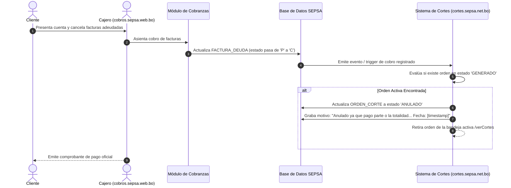

# FLOW-003: Anulación Automática de Orden por Cobranza Concurrente

## Objetivo

Impedir que se ejecute una suspensión en terreno si el cliente regulariza sus planillas impagas en ventanilla de cobranzas o canales bancarios.

## Actor

Cajero Comercial / Proceso Automatizado del Sistema.

## Precondiciones

Orden de corte en estado `GENERADO` pendiente de ejecución en campo.

## Diagrama de Secuencia

## Casos de Prueba Derivados (TDD)

- `TC-FLOW-003-01`: Transición inmediata de `GENERADO` a `ANULADO` al registrarse el pago.
- `TC-FLOW-003-02`: Preservación inmutable de la orden con su traza de auditoría y motivo de anulación.
- `TC-FLOW-003-03`: Desaparición automática de la orden anulada en la bandeja de trabajo de cuadrillas.
