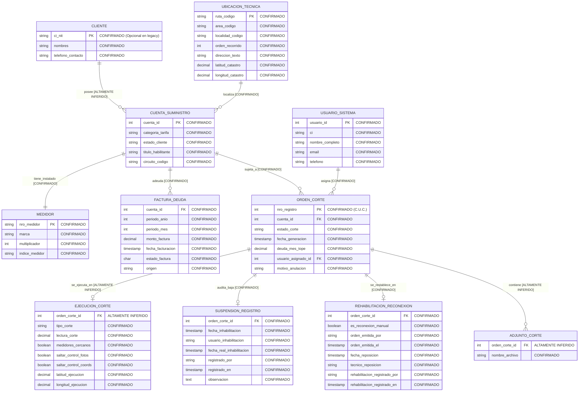

# Diagrama Entidad-Relación (Mermaid ER)

```mermaid
erDiagram
    CLIENTE ||--o{ CUENTA_SUMINISTRO : "posee [ALTAMENTE INFERIDO]"
    UBICACION_TECNICA ||--o{ CUENTA_SUMINISTRO : "localiza [CONFIRMADO]"
    CUENTA_SUMINISTRO ||--|| MEDIDOR : "tiene_instalado [CONFIRMADO]"
    CUENTA_SUMINISTRO ||--o{ FACTURA_DEUDA : "adeuda [CONFIRMADO]"
    CUENTA_SUMINISTRO ||--o{ ORDEN_CORTE : "sujeta_a [CONFIRMADO]"
    
    USUARIO_SISTEMA ||--o{ ORDEN_CORTE : "asigna [CONFIRMADO]"
    ORDEN_CORTE ||--o| EJECUCION_CORTE : "se_ejecuta_en [ALTAMENTE INFERIDO]"
    ORDEN_CORTE ||--o| SUSPENSION_REGISTRO : "audita_baja [CONFIRMADO]"
    ORDEN_CORTE ||--o| REHABILITACION_RECONEXION : "se_restablece_en [CONFIRMADO]"
    ORDEN_CORTE ||--o{ ADJUNTO_CORTE : "contiene [ALTAMENTE INFERIDO]"

    CLIENTE {
        string ci_nit PK "CONFIRMADO (Opcional en legacy)"
        string nombres "CONFIRMADO"
        string telefono_contacto "CONFIRMADO"
    }
    CUENTA_SUMINISTRO {
        int cuenta_id PK "CONFIRMADO"
        string categoria_tarifa "CONFIRMADO"
        string estado_cliente "CONFIRMADO"
        string titulo_habilitante "CONFIRMADO"
        string circuito_codigo "CONFIRMADO"
    }
    UBICACION_TECNICA {
        string ruta_codigo PK "CONFIRMADO"
        string area_codigo "CONFIRMADO"
        string localidad_codigo "CONFIRMADO"
        int orden_recorrido "CONFIRMADO"
        string direccion_texto "CONFIRMADO"
        decimal latitud_catastro "CONFIRMADO"
        decimal longitud_catastro "CONFIRMADO"
    }
    MEDIDOR {
        string nro_medidor PK "CONFIRMADO"
        string marca "CONFIRMADO"
        int multiplicador "CONFIRMADO"
        string indice_medidor "CONFIRMADO"
    }
    ORDEN_CORTE {
        int nro_registro PK "CONFIRMADO (C.U.C.)"
        int cuenta_id FK "CONFIRMADO"
        string estado_corte "CONFIRMADO"
        timestamp fecha_generacion "CONFIRMADO"
        decimal deuda_mes_tope "CONFIRMADO"
        int usuario_asignado_id FK "CONFIRMADO"
        string motivo_anulacion "CONFIRMADO"
    }
    EJECUCION_CORTE {
        int orden_corte_id FK "ALTAMENTE INFERIDO"
        string tipo_corte "CONFIRMADO"
        decimal lectura_corte "CONFIRMADO"
        boolean medidores_cercanos "CONFIRMADO"
        boolean saltar_control_fotos "CONFIRMADO"
        boolean saltar_control_coords "CONFIRMADO"
        decimal latitud_ejecucion "CONFIRMADO"
        decimal longitud_ejecucion "CONFIRMADO"
    }
    SUSPENSION_REGISTRO {
        int orden_corte_id FK "CONFIRMADO"
        timestamp fecha_inhabilitacion "CONFIRMADO"
        string usuario_inhabilitacion "CONFIRMADO"
        timestamp fecha_real_inhabilitacion "CONFIRMADO"
        string registrado_por "CONFIRMADO"
        timestamp registrado_en "CONFIRMADO"
        text observacion "CONFIRMADO"
    }
    REHABILITACION_RECONEXION {
        int orden_corte_id FK "CONFIRMADO"
        boolean es_reconexion_manual "CONFIRMADO"
        string orden_emitida_por "CONFIRMADO"
        timestamp orden_emitida_el "CONFIRMADO"
        timestamp fecha_reposicion "CONFIRMADO"
        string tecnico_reposicion "CONFIRMADO"
        string rehabilitacion_registrado_por "CONFIRMADO"
        timestamp rehabilitacion_registrado_en "CONFIRMADO"
    }
    FACTURA_DEUDA {
        int cuenta_id FK "CONFIRMADO"
        int periodo_anio "CONFIRMADO"
        int periodo_mes "CONFIRMADO"
        decimal monto_factura "CONFIRMADO"
        timestamp fecha_facturacion "CONFIRMADO"
        char estado_factura "CONFIRMADO"
        string origen "CONFIRMADO"
    }
    USUARIO_SISTEMA {
        int usuario_id PK "CONFIRMADO"
        string ci "CONFIRMADO"
        string nombre_completo "CONFIRMADO"
        string email "CONFIRMADO"
        string telefono "CONFIRMADO"
    }
    ADJUNTO_CORTE {
        int orden_corte_id FK "ALTAMENTE INFERIDO"
        string nombre_archivo "CONFIRMADO"
    }
```
