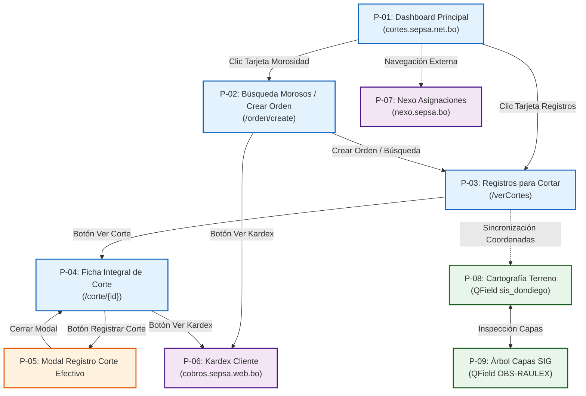

# Mapa de Navegación Global

## Matriz de Transiciones de Navegación

| Pantalla Origen | Acción Realizada | Elemento Utilizado | Pantalla Destino |
| --- | --- | --- | --- |
| P-01: Dashboard | Clic en tarjeta "Búsqueda de Morosidad / Crear orden" | Tarjeta UI con enlace | P-02: Búsqueda `/orden/create` |
| P-01: Dashboard | Clic en tarjeta "Ver Registros para Cortar (Con mapa)" | Tarjeta UI con enlace | P-03: Bandeja `/verCortes` |
| P-02: Búsqueda Morosos | Clic en botón "Ver Kardex" de una fila | Botón de acción en tabla | P-06: Kardex Cobros (nueva pestaña) |
| P-02: Búsqueda Morosos | Clic en "Crear orden de corte" tras filtros | Botón rojo destacado | P-03: Bandeja `/verCortes` |
| P-03: Bandeja `/verCortes` | Clic en botón "Ver corte" de un registro | Botón en columna Acción | P-04: Ficha `/corte/{id}` |
| P-04: Ficha de Corte | Clic en botón rojo "Registrar corte efectivo" | Botón de acción principal | P-05: Modal Registro Corte Efectivo |
| P-04: Ficha de Corte | Clic en botón superior "Ver Kardex" | Botón en toolbar superior | P-06: Kardex Cobros (nueva pestaña) |
| P-04: Ficha de Corte | Clic en botón superior "Actualizar" | Botón en toolbar superior | P-04: Ficha de Corte (Recarga) |
| P-05: Modal Reg. Corte | Clic en botón "Cerrar" | Botón secundario modal | P-04: Ficha de Corte |
| Navegador Web | Apertura de app móvil en campo | Cambio de dispositivo | P-08: QField Proyecto Móvil |

## Diagrama de Navegación Global (Mermaid)

